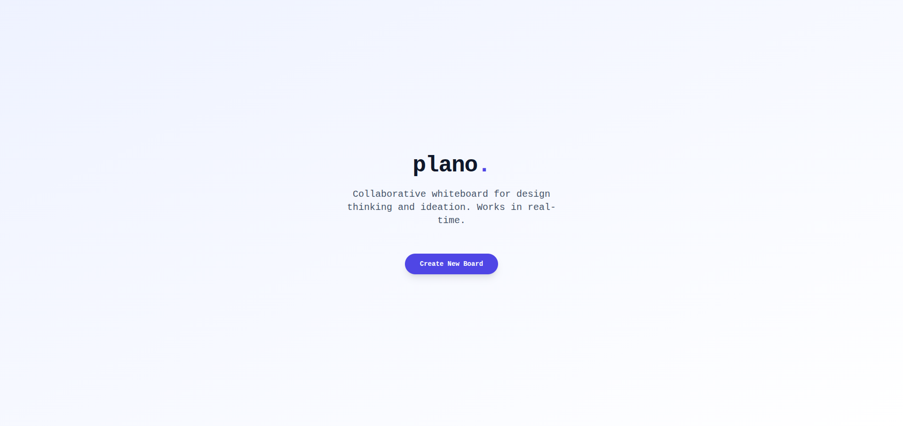
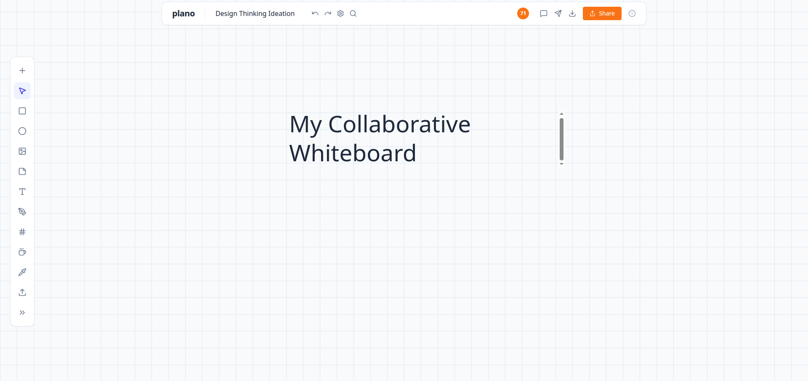

# Plano 🎨

A real-time collaborative whiteboard platform built for design thinking and fluid ideation. 



## 🚀 Features

*   **Real-Time Collaboration:** Built with Socket.IO to support live cursor tracking and immediate element syncing across users.
*   **Fluid Animations:** Integrated Framer Motion for highly responsive and smooth UI interactions.
*   **Persistent Storage:** Backed by a cloud-based Postgres database to instantly save whiteboard designs with optimized data formatting.
*   **Modern Workspace:** Features an infinite-feeling grid canvas equipped with shape tools, text elements, and administrative sharing controls.

---

## 📷 App Preview

### The Canvas


---

## 🛠️ Tech Stack

*   **Frontend:** Next.js, TypeScript, Tailwind CSS
*   **Animations:** Framer Motion
*   **Real-time Infrastructure:** Socket.IO
*   **Database:** Postgres

---

## ⚙️ Getting Started

### Prerequisites

Ensure you have **Node.js** installed on your system.

### Installation & Local Development

1. **Clone the repository:**
```bash
   git clone [https://github.com/yarrmani/Collaborative-Whiteboard.git](https://github.com/yarrmani/Collaborative-Whiteboard.git)
   cd Collaborative-Whiteboard
